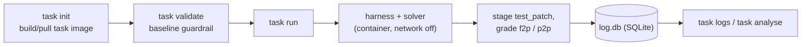

# SWE-bench CLI

[](https://www.python.org/downloads/)
[](https://docs.docker.com/get-docker/)
[](https://www.sqlite.org/)
[](docs/HARNESSES.md)
[](https://docs.astral.sh/uv/)
[](https://typer.tiangolo.com/)

Run **SWE-bench-style coding evals** in isolated, reproducible containers: throw a real repo + a problem statement + gated tests at an LLM **solver**, drive it with a pluggable **harness**, and get back a structured verdict — all logged to SQLite.

```
bundle (task.json, description, patch, gated tests)
   └─▶ task init ─▶ task validate ─▶ task run ─▶ grade f2p/p2p ─▶ log.db
```

---

## Features

- **Fully isolated solves** — the solver edits a throwaway container with the network **off** and no host mounts; its changes die with the container.
- **SWE-bench-style grading** — `fail2pass` must fail on baseline and pass after a fix; `pass2pass` must never regress.
- **Gated tests hidden from the solver by construction** — the test patch is staged only *after* the harness finishes, never shown to the LLM.
- **Pluggable harnesses** — `stub` (zero-LLM golden-patch check), `mini-swe-agent`, `opencode`. Any solver via `--solver <model>`; any OpenAI-compatible endpoint via `--api-base`.
- **Every invocation logged** — results, the solver's patch, and its full transcript are queryable by run id. `task analyse` turns a run into an LLM-synthesized report.
- **Reproducible & debuggable** — each `run` commits a snapshot image for post-mortem inspection.

## Terminology

| term | meaning |
|---|---|
| **bundle** | one coding task: repo + commit, `description.md`, golden `patch.diff`, gated test ids |
| **harness** | the driver/framework that runs a solve (`stub`, `mini-swe-agent`, `opencode`) |
| **solver** | the actual LLM being benchmarked (e.g. `anthropic/claude-sonnet-4-5`) — the thing this tool measures |
| **fail2pass (f2p)** | tests that must fail on baseline, pass after a correct fix — the "bug is fixed" signal |
| **pass2pass (p2p)** | tests that must pass before *and* after — regression guard |
| **golden patch** | the known-correct fix; applied by the `stub` harness to prove grading is right |

## How it works



One **image per task**, a **throwaway container per command** — every command starts from a pristine baseline, so one run's mutations can never leak into another.

## Table of contents

- [Requirements](#requirements)
- [Install](#install)
- [Quickstart](#quickstart)
- [Commands](#commands)
- [Harnesses & solvers](#harnesses--solvers)
- [Logging & analysis](#logging--analysis)
- [Development](#development)
- [Further reading](#further-reading)

## Requirements

- **Python 3.11+**
- [`uv`](https://docs.astral.sh/uv/) — `curl -LsSf https://astral.sh/uv/install.sh | sh`
- **Docker** (or a compatible engine — OrbStack, Docker Desktop, Colima) running locally

## Install

```bash
git clone https://github.com/Neelesh2512/swe-bench-cli
cd swe-bench-cli
uv sync
```

Run the CLI via `uv run task ...`. `--harness mini-swe-agent` needs one more extra: `uv sync --extra agent`. `--harness stub` / `opencode` need nothing else (opencode's binary installs inside the container image, not on the host).

## Quickstart

```bash
uv run task bundles
uv run task init bundles/ansible-check-type-dict
uv run task validate bundles/ansible-check-type-dict
uv run task run bundles/ansible-check-type-dict --harness stub
uv run task logs --list
```

<details>
<summary>Click to see an example session</summary>

```text
$ uv run task validate bundles/ansible-check-type-dict
baseline: fail2pass 1/1, pass2pass 1/1 as expected  (run id 2)

$ uv run task run bundles/ansible-check-type-dict --harness stub
harness=stub solver=opencode/north-mini-code-free: post_solver: fail2pass 1/1, pass2pass 1/1 passed  (run id 3)

$ uv run task logs 3
[3] run ansible__ansible-d9f1866 — success
  post_solver: fail2pass 1/1, pass2pass 1/1 passed
    OK fail2pass  passed (exp passed)  test/units/module_utils/common/validation/test_check_type_dict.py::test_check_type_dict_fail
    OK pass2pass  passed (exp passed)  test/units/module_utils/common/validation/test_check_type_dict.py::test_check_type_dict
```

`stub` applies the bundle's golden patch directly — no LLM, no reasoning. It proves the harness/grading is correct: fail2pass flips fail→pass, pass2pass stays pass. Swap in `--harness opencode` for a real LLM run.
</details>

All output is rendered with [`rich`](https://github.com/Textualize/rich) — colored diffs, syntax-highlighted JSON, tables. Colors auto-disable when piped/redirected, same as `git`/`ls`.

## Commands

| command | what it does |
|---|---|
| `task bundles [dir]` | List available bundles (task_id, repo, test counts, harness default). No Docker. |
| `task init <bundle>` | Build/pull the task image, verify the harness can run in it. |
| `task validate <bundle>` | Guardrail: assert fail2pass all fail / pass2pass all pass on the untouched baseline. |
| `task run <bundle> --harness <h> --solver <model>` | Invoke a harness+solver, then grade fail2pass/pass2pass again. |
| `task logs [id]` | Query the log DB — `--list`, `--json`, `--diff`, `--transcript`. |
| `task analyse <run-id> --llm <model>` | LLM-synthesized human-readable report over a stored run. |

## Harnesses & solvers

| harness | what it does | needs |
|---|---|---|
| `stub` | applies the golden `patch.diff`, ignores `--solver` | nothing |
| `opencode` | external Go coding agent, runs headless inside the container | network (it calls the LLM itself) |
| `mini-swe-agent` | pure-Python agent loop; LLM call in our host process via litellm | `uv sync --extra agent` |

Solver precedence: **CLI flag > bundle's `task.json` "harness" block > hardcoded fallback**. `--api-key` is CLI/env-only and never logged — task.json is meant to be committed and shared, a key never belongs in it.

Full harness/solver/provider config (including any OpenAI-compatible endpoint via `--api-base`): [`docs/HARNESSES.md`](docs/HARNESSES.md).

## Logging & analysis

Every invocation writes a row to `.task-bundle/log.db` (`commands` + `test_results`), so collaborators query a run id instead of reproducing it:

- `task logs <id>` — summary + per-test results (`--json`, `--diff`, `--transcript` for raw / colorized views)
- `task logs --list` — recent commands as a table
- `task analyse <run-id> --llm <model>` — one-shot LLM report over a stored run's transcript, patch, and before/after test results (no Docker involved)

## Development

```bash
uv run pytest
```

Pure-logic tests (no Docker needed) — test-outcome expectations, bundle loading, DB roundtrip. `task run --harness stub` on an example bundle is the integration test; run it manually to confirm the live pipeline end to end.

**Layout**: `src/swe_bench_cli/` — `cli.py` (commands), `bundle.py` (task.json loading), `container.py` (Docker), `db.py` (SQLite), `harnesses/` (pluggable drivers), `analyse.py`, `display.py` (rich output). `bundles/` holds example task bundles; `docs/` holds design notes and usage guides.

## Further reading

- [`docs/DESIGN.md`](docs/DESIGN.md) — architecture, tradeoffs, bugs found and fixed by actually using the tool.
- [`docs/TECH_STACK.md`](docs/TECH_STACK.md) — why each dependency/choice.
- [`docs/HARNESSES.md`](docs/HARNESSES.md) — harnesses, solver/provider config, per-bundle defaults, `task analyse`.
- [`docs/BUNDLES.md`](docs/BUNDLES.md) — `task.json` schema, writing a bundle, the included examples, known limitations.
